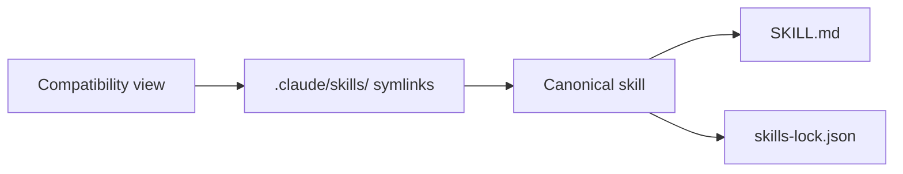

# Context

This repository (Track4) runs the quirk Skills workflow system. The canonical skills bundle is installed in `.agents/skills/` and pinned by `skills-lock.json`.

Use the repository-local docs in `docs/agents/` to understand issue tracking, work-item format, domain-doc layout, and triage labels before using the workflow skills.

## Local setup

- Skills bundle installed from the canonical upstream: `https://github.com/quantumquirkxyz/skills-quirk` (`main` @ `7c4877f`, bundle version `0.1.0`).
- This bootstrap installed only the bundle scope: `.agents/skills/`, `.claude/skills/`, `docs/agents/`, `CONTEXT.md`, `README.md`, and `skills-lock.json`. No ADR surface was created.
- The repository has no application code or work items yet; treat it as greenfield.
- Before the first work item, finish the tracker and domain setup described in `docs/agents/adoption-guide.md`: run `setup-quirk-skills`, then configure `docs/agents/issue-tracker.md`, `docs/agents/triage-labels.md`, and `docs/agents/domain.md` for this project.

## Validation

Run from the repository root:

```bash
node .agents/skills/platform/check-all.mjs
```

Expected result: `status: "pass"`.

## Vocabulary

| Term | Meaning |
|---|---|
| **quirk Skills** | The workflow bundle installed in this repository under `.agents/skills/` |
| **quirk Method** | The workflow philosophy that governs how the skills route work, preserve context, produce artifacts, review changes, repair findings, and ship |
| **Canonical skill** | A skill folder under `.agents/skills/` with a `SKILL.md` entrypoint and matching `skills-lock.json` entry |
| **Compatibility view** | The `.claude/skills/` symlink tree that exposes canonical skills to consumers expecting that layout |
| **Provenance** | The recorded origin and redesign status of a skill, name, or workflow |



## Usage rules

- Use **quirk Skills** when referring to the whole workflow system.
- Use **quirk Method** when discussing why the skills behave the way they do.
- Use **Canonical skill** when distinguishing real skills from compatibility symlinks.
- Use **Compatibility view** when discussing installation or parity.
- Use **Provenance** when discussing authorship, influence, retired aliases, or renamed skills.