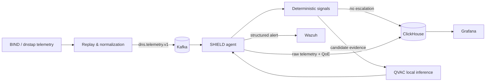
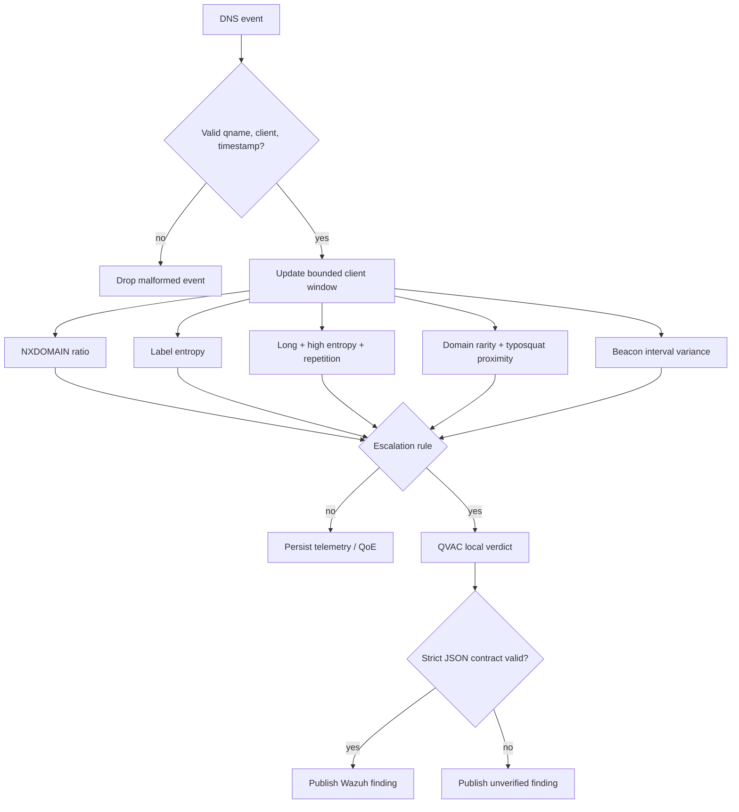

# SHIELD — Private DNS Intelligence at the Edge

**SHIELD** is a local-first DNS telemetry intelligence system for regulated and privacy-sensitive infrastructure. It consumes DNS events as an additional Kafka consumer, detects suspicious behavior with an explainable deterministic stage, escalates only relevant evidence to a **local QVAC model**, produces structured Wazuh alerts, and computes an interpretable per-site DNS Quality of Experience (QoE) score in ClickHouse and Grafana.

> DNS telemetry can reveal browsing and operational behavior. SHIELD is designed so inference remains on the operator-controlled machine or private network. There is no cloud-inference fallback.

## What SHIELD delivers

- **Security:** DGA, DNS tunneling, typosquatting and periodic beaconing detection with signal evidence and a local model verdict.
- **Operational QoE:** a 0–100 score per site/minute using latency, NXDOMAIN rate and saturation signals.
- **SOC integration:** structured remote-syslog events decoded and classified by Wazuh rules.
- **Local AI:** QVAC exposes the model through a local OpenAI-compatible HTTP endpoint; SHIELD rejects public inference endpoints.
- **Reproducible replay:** the supplied BIND-style query corpus can be replayed with deterministic attack episodes and synthetic dnstap fields where the source log has no response telemetry.
- **Observable data plane:** Kafka transports telemetry, ClickHouse stores raw/aggregate data, and Grafana provides the operator view.

## Architecture



### Detection path



The first stage is deliberately deterministic. QVAC is not asked to inspect every DNS request; it reasons only over candidates and their signal evidence. This keeps inference bounded and makes every model call traceable to a concrete trigger.

## Local inference boundary

SHIELD uses `QWEN3_1_7B_INST_Q4` by default. The agent accepts only `http://` endpoints that resolve to loopback, link-local or private addresses (plus the local Docker service names). A public hostname/IP is rejected before an inference request is sent.

The recommended setup is to run QVAC directly on the host, because the model is already installed there:

```bash
qvac serve --openai --no-default \
  --config deploy/qvac/qvac.config.json \
  --model QWEN3_1_7B_INST_Q4 \
  --port 11434
```

Verify the local endpoint before starting the data plane:

```bash
curl -fsS http://localhost:11434/ping
```

## Quick start

### 1. Requirements

You need Docker with Compose v2, Python 3.11+ for local tests, a locally installed QVAC runtime with `QWEN3_1_7B_INST_Q4`, and the DNS query corpus available on disk.

### 2. Configure

```bash
cp .env.example .env
```

The default container-to-host inference URL is:

```text
QVAC_URL=http://host.docker.internal:11434
```

Do not configure a public inference URL. SHIELD will refuse it.

### 3. Prepare the DNS corpus

The source corpus is intentionally not redistributed. Prepare the local ignored data directory with:

```bash
DATASET_SOURCE=/path/to/LogsDNSQueries.zip ./scripts/prepare-dataset.sh
```

The source query records remain unchanged. The replay layer adds versioned operational fields needed by the demo pipeline (`rcode`, latency, zone and PoP identity) because those response-side fields are absent from the BIND query log. Synthetic attack records are explicitly labeled with `ground_truth`; production detection code does not consume that field.

### 4. Start the stack

Keep QVAC running on the host, then start the data plane:

```bash
docker compose --env-file .env -f deploy/docker-compose.yml up -d \
  kafka kafka-init clickhouse grafana wazuh emulator agent
```

Inspect health and logs:

```bash
docker compose --env-file .env -f deploy/docker-compose.yml ps
docker compose --env-file .env -f deploy/docker-compose.yml logs -f agent
```

Grafana is available at `http://localhost:3000`. ClickHouse HTTP is exposed at `http://localhost:8123`. QVAC remains on `http://localhost:11434`.

An optional containerized QVAC profile remains available for machines that have a suitable local image/model bundle:

```bash
docker compose --env-file .env -f deploy/docker-compose.yml --profile container-qvac up -d qvac
```

## Event and verdict contracts

The normalized telemetry contract is versioned and contains the query identity, client, qtype, response code, latency, zone and PoP context. Evaluation-only provenance can be present in replayed events, but the agent never uses it to make a detection decision.

QVAC receives only a compact candidate payload:

```json
{
  "qname": "example.invalid",
  "signal_evidence": {
    "nxdomain_ratio": {"ratio": 0.83, "threshold": 0.6, "samples": 12}
  },
  "context": {"client_ip": "10.0.0.10"}
}
```

The accepted model contract is:

```json
{
  "verdict": "dga",
  "confidence": 0.94,
  "reasoning_short": "High NXDOMAIN ratio and algorithmic label shape.",
  "recommended_action": "Investigate the client and block the domain if confirmed."
}
```

`verdict` must be exactly one of `benign`, `dga`, `tunnel`, `beaconing`, or `typosquat`. Invalid output or an unavailable local model becomes an `unverified` finding rather than silently becoming benign.

## QoE model

The minute-level score is intentionally interpretable:

```text
QoE = 45% latency + 35% DNS success + 20% saturation
```

The exact normalization thresholds and rationale are versioned in [`config/qoe.yaml`](config/qoe.yaml) and documented in [`docs/adr/0006-qoe-score-model.md`](docs/adr/0006-qoe-score-model.md). Labels are `Excellent` (>=85), `Good` (70–84), `Fair` (50–69), and `Poor` (<50).

## Wazuh integration

The agent emits structured syslog to Wazuh. The repository provisions a custom decoder and local rules under [`deploy/wazuh/`](deploy/wazuh/). Severity is driven by verdict and confidence; benign model results do not create a security rule match, while local-inference failures are retained as lower-severity `unverified` findings for operator review.

## Validation

Run the deterministic test suite first:

```bash
python3 -m pytest -q
```

Validate Compose without starting containers:

```bash
docker compose --env-file .env -f deploy/docker-compose.yml config
```

Run the repository acceptance checks:

```bash
./scripts/verify-delivery.sh
```

For a real-model smoke test:

```bash
QVAC_LIVE_SMOKE=1 python3 -m pytest -q tests/test_qvac_adapter.py
```

A final local-inference verification should be performed with outbound network access disabled after all images/plugins/models are already present. The system intentionally has no heuristic or cloud fallback for that verification.

## Repository map

```text
app/
  agent/       deterministic filter, QVAC adapter, persistence, QoE, Wazuh publisher
  common/      shared health, Kafka and DNS-domain primitives
  emulator/    corpus parser, deterministic replay and attack episodes
  eval/        precision/recall/F1, elimination and latency evaluation
  qoe/         QoE scoring engine
config/        versioned QoE and topology configuration
deploy/        Compose, Kafka, ClickHouse, Grafana, Wazuh and optional QVAC image
scripts/       dataset preparation, baselines and acceptance checks
tests/         unit/integration contract tests
docs/          architecture, domain model, ADRs and operational notes
```

## Design decisions

The architecture decision records are the source of truth for non-trivial choices:

- [`ADR-0001`](docs/adr/0001-read-only-telemetry-consumer.md): read-only telemetry consumer.
- [`ADR-0002`](docs/adr/0002-two-stage-detection.md): deterministic pre-filter + local AI reasoning.
- [`ADR-0003`](docs/adr/0003-qvac-local-http-offline.md): local QVAC HTTP boundary and offline behavior.
- [`ADR-0004`](docs/adr/0004-wazuh-syslog-ingestion.md): Wazuh ingestion contract.
- [`ADR-0005`](docs/adr/0005-telemetry-schema-synthesized-dnstap.md): replay schema and synthesized response telemetry.
- [`ADR-0006`](docs/adr/0006-qoe-score-model.md): QoE scoring model.

See [`docs/design.md`](docs/design.md) for the detailed system design and [`docs/domain.md`](docs/domain.md) for terminology.

## Provenance and pre-existing components

For reproducibility and attribution, SHIELD declares the external/pre-existing foundations used by the repository:

| Component | Origin | Role in SHIELD |
|---|---|---|
| quirk Skills bundle | `quantumquirkxyz/skills-quirk`, pinned in `skills-lock.json` | Repository engineering workflow only; not runtime product code |
| DNS query corpus | Ovnicom-provided BIND9 query dataset | Read-only replay input; not redistributed |
| QVAC runtime and model registry | Tether QVAC (`qvac.tether.io`, `github.com/tetherto/qvac`) | Local inference runtime and `QWEN3_1_7B_INST_Q4` model |
| Kafka, ClickHouse, Grafana, Wazuh | Their official container distributions | Local data plane, storage, visualization and SIEM |
| Public DGA/typosquatting references | Public domain-security references used by the emulator | Synthetic evaluation traffic only |

The zone-to-PoP mapping, latency profiles and injected attack episodes are synthetic evaluation fixtures. They are not represented as observed production facts.

## Privacy and security model

SHIELD assumes DNS telemetry is sensitive. The inference payload contains only the candidate qname, deterministic evidence and minimal operational context. No component requires a cloud AI API. Operators should additionally restrict container egress, protect Kafka/ClickHouse/Wazuh interfaces from untrusted networks, replace demonstration credentials, and apply their normal retention and access-control policy before production deployment.

## Status

The repository contains the complete reference pipeline and deterministic tests. A deployment is considered operational only after the local QVAC smoke test, Kafka ingestion, ClickHouse writes, QoE aggregation, Grafana datasource/dashboard and Wazuh alert path have all been verified on the target machine.
