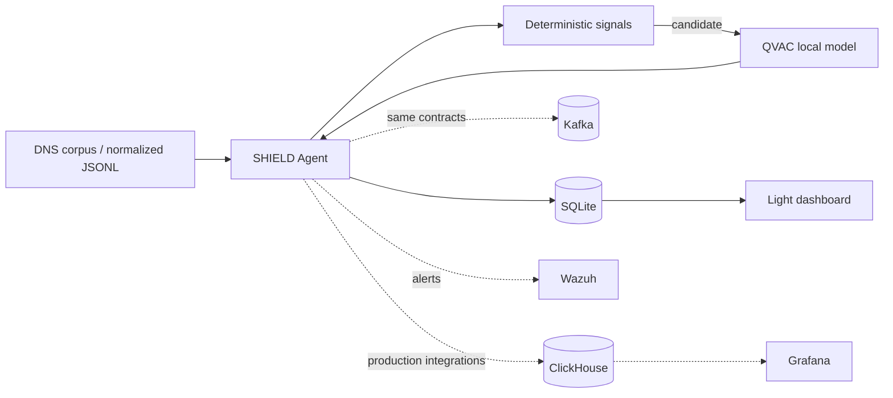
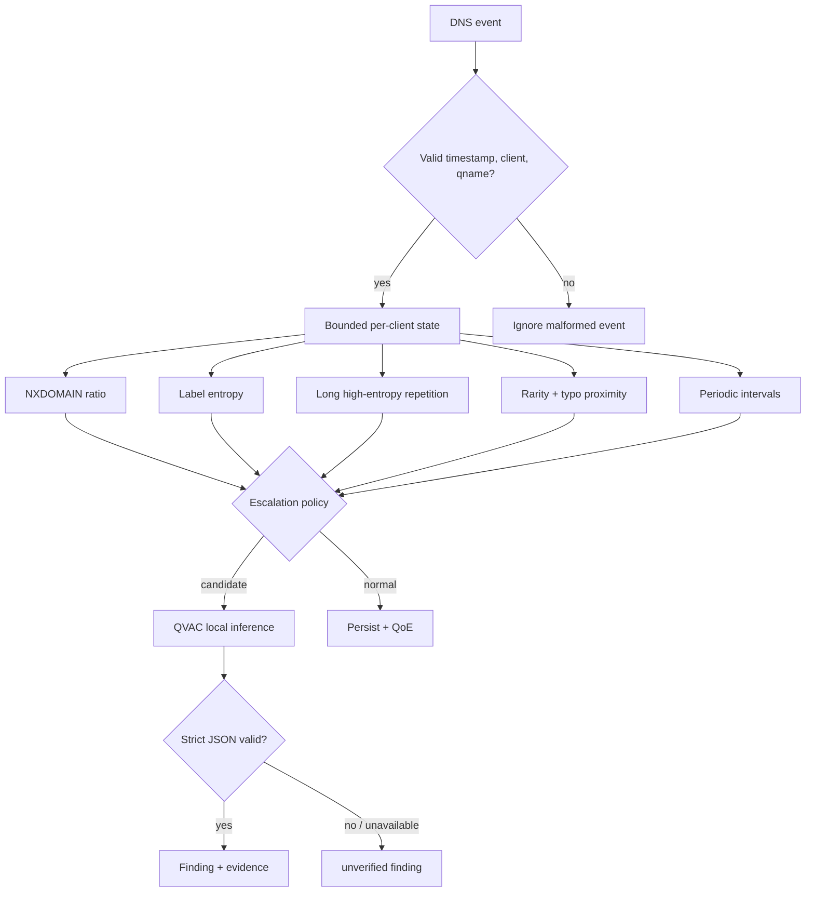
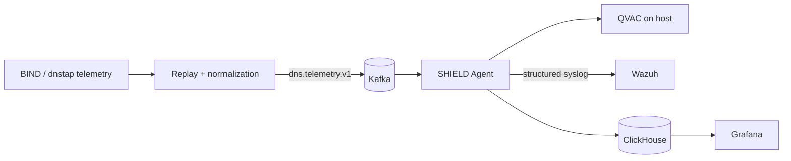

# SHIELD — Private DNS Intelligence at the Edge

**SHIELD** is a local-first DNS intelligence agent for privacy-sensitive infrastructure. It detects DGA, DNS tunneling, typosquatting and periodic beaconing, explains why a query was escalated, asks a **local QVAC model** for the final semantic verdict, and computes an interpretable per-site DNS Quality of Experience (QoE) score.

> DNS telemetry can expose browsing and operational behavior. SHIELD keeps inference on the operator-controlled machine or private network and has no cloud-inference fallback.

## Two ways to run

SHIELD deliberately separates the product logic from infrastructure. **Light mode is the recommended workstation path**: QVAC + Python + SQLite + a dependency-free dashboard. The full integration path remains available for validating Kafka, ClickHouse, Grafana and Wazuh.



The local path is not a mock. It uses the same detector, QoE engine and real QVAC adapter as the full topology; only the transport, persistence and presentation adapters are lighter.

## Fastest path: light mode

Requirements: Python 3.11+, your locally installed QVAC runtime/model, and the DNS corpus under `docs/data/LogsDNSQueries` (or set `DATASET_PATH`). No Docker is required.

Start QVAC on the host using the command supported by your installed QVAC version and expose its OpenAI-compatible endpoint on `127.0.0.1:11434`. SHIELD defaults to model `QWEN3_1_7B_INST_Q4` and refuses public inference endpoints.

Then run:

```bash
./scripts/run-light.sh
```

Open `http://127.0.0.1:8080`. The script replays a bounded sample of the real corpus, injects deterministic evaluation episodes, sends only escalated evidence to your local QVAC endpoint, persists results in `data/shield.db`, and serves the local dashboard. Tune the workload without changing code:

```bash
LIGHT_LIMIT=10000 DATASET_PATH=/path/to/LogsDNSQueries ./scripts/run-light.sh
```

For a manual pipeline, first normalize/replay to JSONL and then process it:

```bash
python -m app.emulator.cli --dataset docs/data/LogsDNSQueries --rate 0 --attack --emit json --out data/input.jsonl --limit 50000
python -m app.light.runtime --input data/input.jsonl --db data/shield.db --qvac-url http://127.0.0.1:11434
python -m app.light.web --db data/shield.db --port 8080
```

## Detection path



The deterministic stage prevents sending every query through an LLM. Every QVAC call is attributable to concrete evidence. The accepted verdicts are `benign`, `dga`, `tunnel`, `beaconing`, and `typosquat`; malformed/unavailable inference degrades to `unverified`, never silently to benign.

## Local dashboard

The light dashboard is intentionally dependency-free and binds to loopback by default. It shows query volume, alert count/rate, average QVAC latency, threat distribution, recent detections and current QoE windows. It reads the same local SQLite database written by the light runtime and refreshes without a build step or Node runtime.

## QoE

SHIELD computes a per-site/minute 0–100 score from three explainable components:

```text
QoE = 45% latency + 35% DNS success + 20% saturation
```

Labels are `Excellent` (>=85), `Good` (70–84), `Fair` (50–69), and `Poor` (<50). Exact thresholds and rationale live in `config/qoe.yaml` and `docs/adr/0006-qoe-score-model.md`.

## Full integration topology

Use this only when validating infrastructure integrations or deploying the reference topology. Keep QVAC running on the host, then:

```bash
cp .env.example .env
docker compose --env-file .env -f deploy/docker-compose.yml up -d \
  kafka kafka-init clickhouse grafana wazuh emulator agent
```

On Linux the agent maps `host.docker.internal` to the host gateway, so the container can reach the host QVAC service. An optional `container-qvac` profile exists for environments with an appropriate preloaded local QVAC image/model bundle.



## Dataset and reproducibility

The source DNS corpus is intentionally not redistributed. Prepare the ignored local directory with:

```bash
DATASET_SOURCE=/path/to/LogsDNSQueries.zip ./scripts/prepare-dataset.sh
```

The original query records remain unchanged. The replay layer synthesizes response-side fields (`rcode`, latency, zone and PoP identity) when the source BIND query log does not contain them. Synthetic attack records carry `ground_truth` exclusively for evaluation; production detection code does not consume that field. `DEMO_SEED=42` makes injected traffic and synthetic operational context reproducible.

## Evaluation and acceptance

The evaluation harness reports per-class and macro precision/recall/F1, deterministic-filter elimination rate and filter/QVAC latency. Run the deterministic suite with:

```bash
python3 -m pytest -q
```

Because the actual model is installed on the operator workstation, the strongest acceptance check runs there against the real OpenAI-compatible QVAC endpoint:

```bash
python3 scripts/verify-light.py \
  --dataset docs/data/LogsDNSQueries \
  --qvac-url http://127.0.0.1:11434 \
  --limit 50000
```

This command first requires `/v1/models` to be reachable, then replays a deterministic corpus sample plus evaluation episodes through the real detector and QVAC adapter. It writes the ignored `data/validation-report.json` containing PASS/FAIL checks, processed events, QVAC candidate count, filter reduction, verdict distribution, unverified responses, QoE windows, and QVAC p50/p95 latency. A PASS requires real events, at least one QVAC candidate, no invalid/unavailable QVAC verdicts in the sample, and generated QoE windows.

The narrower adapter smoke test remains available:

```bash
QVAC_LIVE_SMOKE=1 python3 -m pytest -q tests/test_qvac_adapter.py
```

For the full topology also run:

```bash
docker compose --env-file .env -f deploy/docker-compose.yml config
./scripts/verify-delivery.sh
```

A deployment should only be described as operational after the target machine has verified real local QVAC inference, corpus replay, security detections and QoE output. When using the full topology, additionally verify Kafka, ClickHouse, Grafana and Wazuh. The repository intentionally contains no fake QVAC server.

## QVAC contract

QVAC receives a compact candidate payload rather than the raw stream:

```json
{"qname":"example.invalid","signal_evidence":{"nxdomain_ratio":{"ratio":0.83,"threshold":0.6,"samples":12}},"context":{"client_ip":"10.0.0.10"}}
```

Expected output:

```json
{"verdict":"dga","confidence":0.94,"reasoning_short":"High NXDOMAIN ratio and algorithmic label shape.","recommended_action":"Investigate the client and block the domain if confirmed."}
```

The adapter accepts only local/private HTTP endpoints and bounds timeout, retries and text fields.

## Repository map

```text
app/agent/       detector, QVAC adapter, ClickHouse and Wazuh adapters
app/light/       SQLite runtime and lightweight local dashboard
app/common/      shared Kafka, health and DNS-domain primitives
app/emulator/    corpus parser, replay and deterministic attack episodes
app/eval/        classification and latency evaluation
app/qoe/         QoE scoring engine
config/          versioned QoE/topology configuration
deploy/          optional full integration topology
scripts/         dataset, validation and light-mode entrypoints
tests/           deterministic contract tests
docs/            architecture, domain model and ADRs
```

## Architecture decisions

The ADRs are the source of truth for non-trivial choices: read-only telemetry consumption (`0001`), deterministic pre-filter + local AI (`0002`), local QVAC boundary (`0003`), Wazuh ingestion (`0004`), replay/schema provenance (`0005`) and QoE scoring (`0006`). See `docs/design.md` for the detailed design.

## Provenance and external foundations

For reproducibility, SHIELD declares its external/pre-existing foundations: the quirk Skills bundle pinned by the repository for engineering workflow; the supplied BIND9 query corpus as read-only input; Tether QVAC and its model registry for local inference; official Kafka, ClickHouse, Grafana and Wazuh distributions for the optional integration topology; and public domain-security references used only to synthesize evaluation traffic. Zone/PoP mappings, latency profiles and injected attack episodes are synthetic fixtures and are not represented as observed production facts.

## Privacy and operational security

SHIELD assumes DNS telemetry is sensitive. No cloud AI API is required. The light dashboard binds to `127.0.0.1`; the QVAC adapter rejects public inference endpoints. For a deployed full topology, additionally restrict network exposure/egress, replace demonstration credentials, protect data-plane interfaces, and apply the organization's retention/access-control policy.
