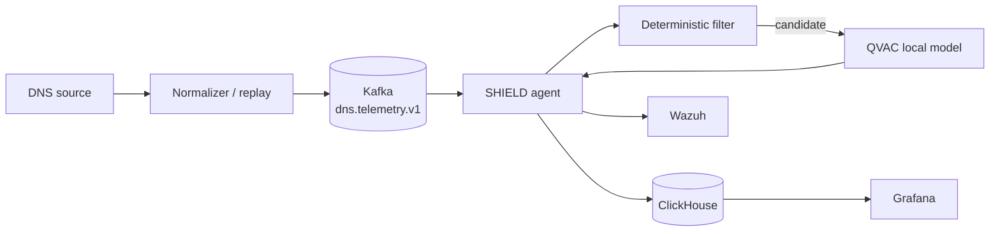
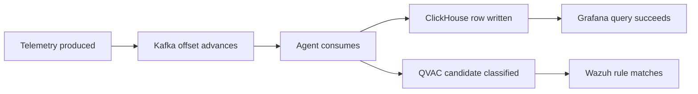

# SHIELD System Design

SHIELD adds local intelligence to DNS telemetry without placing model inference or sensitive query data on a public AI service. The system has two outputs from one stream: explainable security findings and per-site DNS Quality of Experience.

## Design principles

**Local inference is a hard boundary.** QVAC runs on the host or a private service address. The adapter rejects public endpoints and has no cloud fallback.

**The telemetry pipeline remains read-only.** SHIELD consumes an additional Kafka subscription and does not modify the upstream DNS capture path.

**Deterministic evidence precedes model reasoning.** The model is not the first detector. Bounded statistical rules identify candidates and attach evidence; QVAC resolves the higher-level classification.

**Simulation is explicit.** The reference BIND query corpus lacks response-side fields. The replay layer therefore synthesizes `rcode`, latency and topology fields and labels injected attacks with evaluation-only `ground_truth`. Those fields are provenance, not production observations.

**Failures remain visible.** A timeout or malformed model response becomes `unverified`, not `benign`.

## Runtime architecture



Kafka is partitioned by `client_ip`, which preserves per-client ordering for the stateful detector. The agent owns bounded in-memory windows, persistence, QoE aggregation and alert publication. ClickHouse is the analytical store; Wazuh is the security sink.

## Detection stage

| Signal | Default | Escalation behavior |
|---|---:|---|
| NXDOMAIN ratio | `>= 0.60` after at least 5 samples | Alone |
| Shannon entropy | `>= 3.5` | Only with rarity/typosquat evidence |
| Long high-entropy repeated label | `> 40` chars + entropy + repetition | Alone |
| e2ld rarity / typo proximity | rarity `>= 0.20` | Rarity alone never escalates |
| Beacon interval variance | `<= 4.0` with >=2 meaningful gaps | Alone |

The threshold basis comes from the reference corpus distribution: p99 longest-label length is 36 while the maximum is 63, and many qnames are singletons. This is why length is composite and rarity is not independently actionable.

The production implementation lives in `app/agent/filter.py` and shared domain primitives in `app/common/domain.py`. It intentionally has no dependency on `app/emulator.attacks`.

## QVAC reasoning

The agent sends one request per escalated candidate. The system message instructs the model to treat qname/context as untrusted data and return JSON only. Accepted classes are `benign`, `dga`, `tunnel`, `beaconing`, and `typosquat`; `confidence` must be numeric in `[0,1]`.

The adapter limits qname length, bounds response text fields, uses deterministic temperature, applies a request timeout and bounded retry count, and validates the response before creating a finding. The network boundary accepts loopback/private/link-local addresses and the known local container/host service names only.

## Telemetry contract

The normalized event is versioned. The core downstream fields are:

```text
schema_version
ts / timestamp
client_ip
qname
qtype
rcode
latency_ms
zone_id
pop_id
```

Replay/evaluation records may additionally contain `ground_truth`. The agent must never use it as a feature or decision input.

For a production dnstap integration, response code and latency are populated from real message pairs rather than the synthesizer; downstream Kafka, detector, QoE, ClickHouse and Grafana contracts remain unchanged.

## QoE

QoE is aggregated per site and minute. A site is the zone/PoP pair represented by the normalized telemetry. The weighted model is:

```text
score = 0.45 * latency_score
      + 0.35 * dns_success_score
      + 0.20 * saturation_score
```

The model is intentionally operational rather than opaque. Each component can be inspected independently, and the dashboard can show the component responsible for degradation. Configuration and rationale are versioned in `config/qoe.yaml` and ADR-0006.

## Wazuh

Findings are emitted as structured syslog. `deploy/wazuh/etc/decoders/local_decoder.xml` extracts SHIELD fields and `deploy/wazuh/etc/rules/local_rules.xml` maps verdict/confidence to SOC severity. A model failure produces a lower-severity `unverified` event so an operator can distinguish inference degradation from clean traffic.

## Storage and visualization

ClickHouse stores raw normalized telemetry and minute QoE aggregates. Grafana is provisioned from repository files rather than configured manually. The primary operator view should answer three questions quickly: which sites are degraded, what component drives the degradation, and which security findings require attention.

## Reference replay environment

The replay environment combines three sources of information:

1. the externally supplied BIND query corpus, kept read-only;
2. synthetic topology and response-side telemetry required to exercise QoE;
3. deterministic injected security episodes required to measure detector behavior.

Synthetic geography currently includes six PoPs and four client profiles. These values exist only to make the reference environment reproducible and must not be interpreted as observed customer topology.

## Evaluation protocol

Evaluation unit is the query. The harness reports TP/FP/FN/TN, precision, recall and F1, including per-class/macro metrics; filter elimination rate; and filter/QVAC latency percentiles. Zone and PoP splits are reported when available.

The most important separation is between **production decision inputs** and **evaluation labels**. `ground_truth` is generated by the emulator and consumed by the evaluation harness only. It is not passed to the deterministic filter or QVAC.

## Operational acceptance

A deployment is accepted only when the complete path is verified on the target machine:



A passing unit-test suite is necessary but not sufficient. The real local model and external service boundaries must also pass smoke checks.
